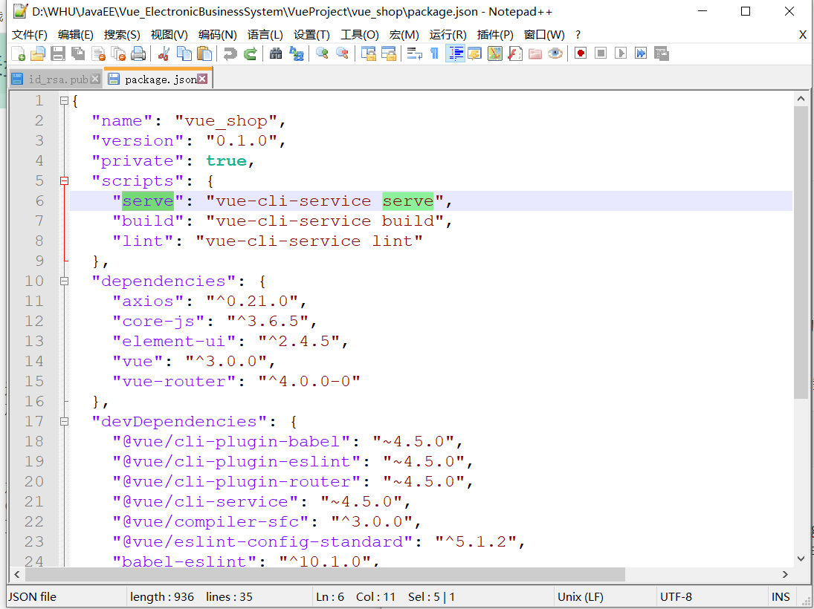
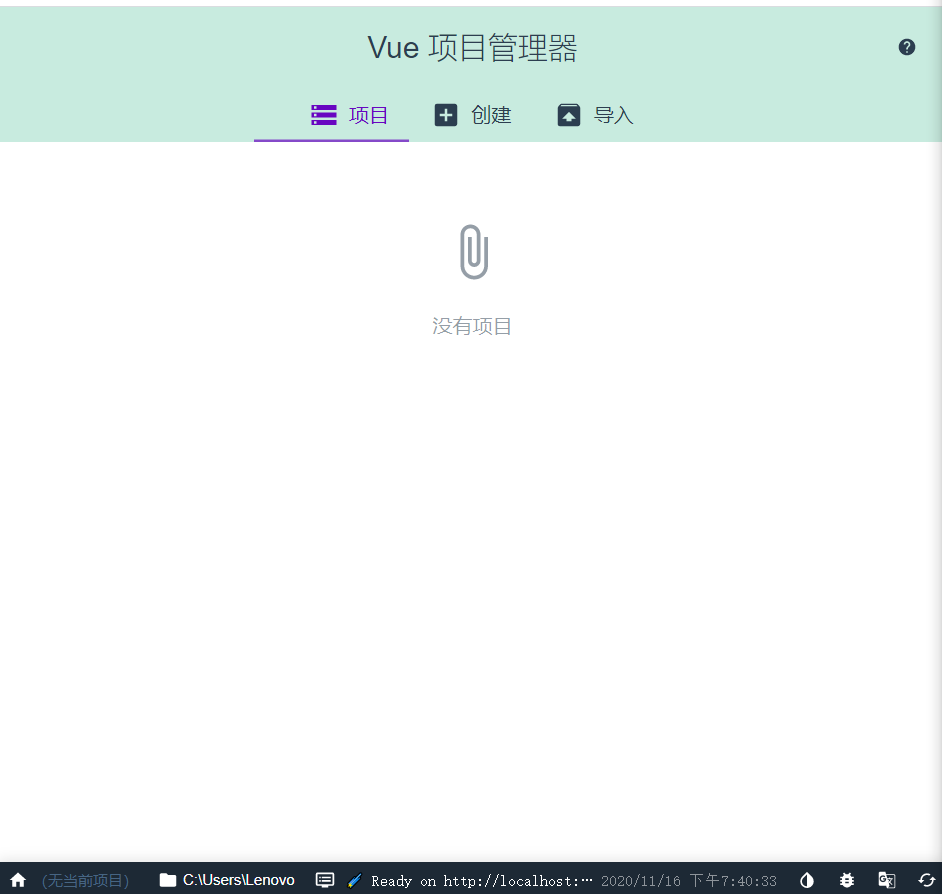
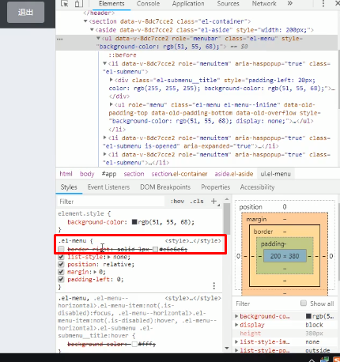
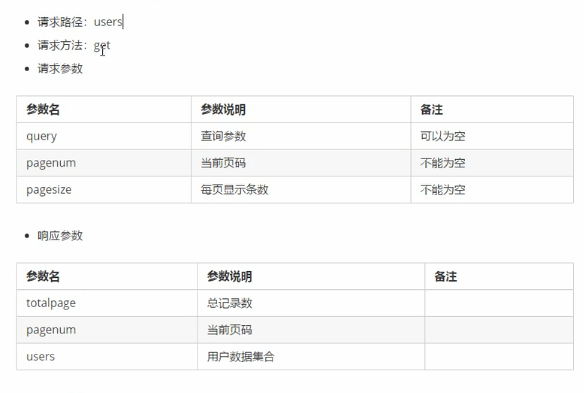
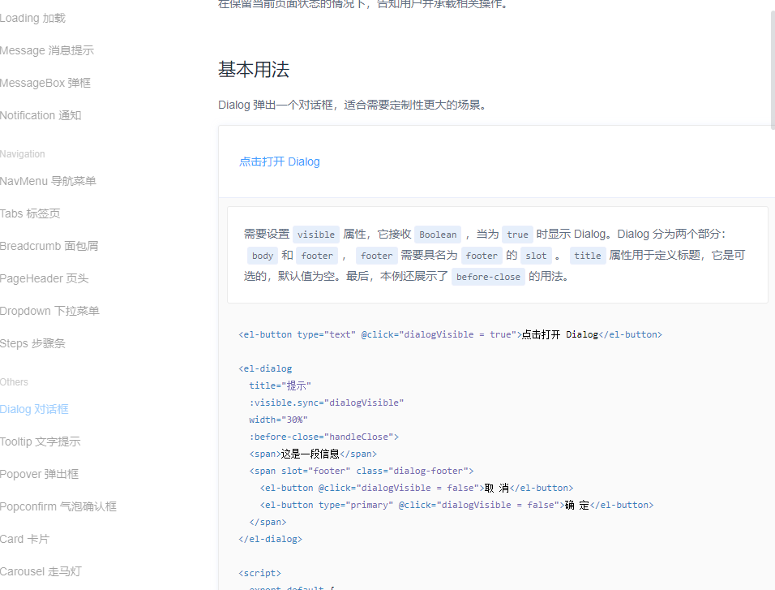
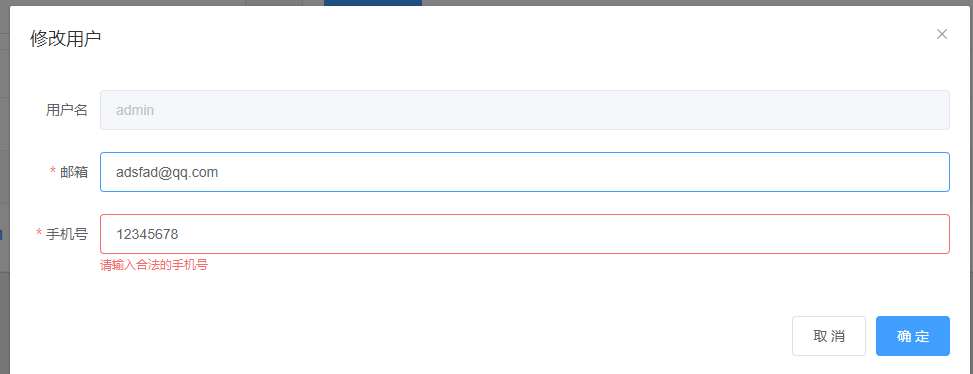
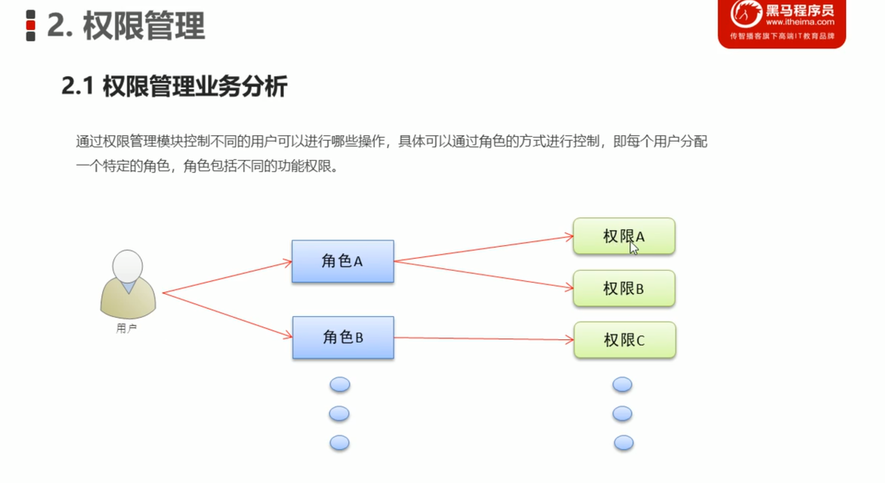
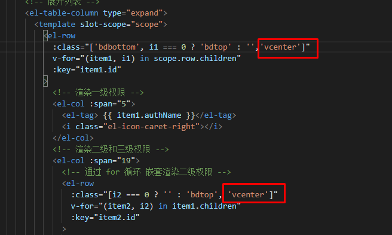
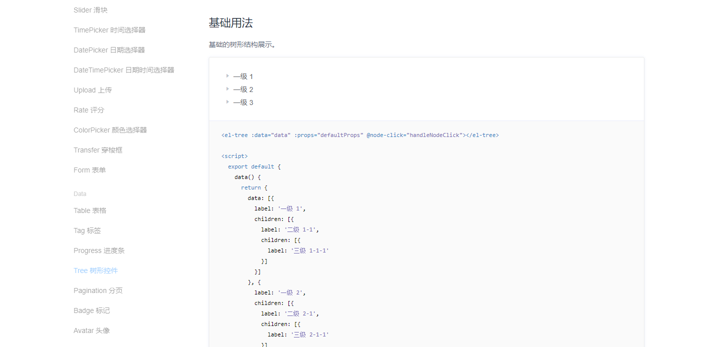

[TOC]

# VS code快捷键

`shift+alt+f`：格式化代码

# GIT

## 1 创建新分支并推送到远程仓库

```
git branch login
git add .
git commit -m "first commit"
git push -u origin login //将本地login分支推送到远程仓库并且远程分支名为login
```


## 2 查看分支信息

用于查看当前分支的修改信息，有哪些文件发生了修改而没有添加到缓存(红色)，发送了修改添加到了缓存为绿色。

```
git status
```

## 3 切换分支

```
git checkout 分支名
```

## 4 合并分支

这是最长用的git功能之一了，首先我们来到开发分支，比如`login`，这是我们打算合并到master的分支，我们运行一下命令：

```
git add .
git commit -m "完成登录退出功能"
```

这样，我们的login的最新代码状态就全部添加到本地git缓存了。然后我们切换到master分支

```
git checkout master
```

之后合并`login`分支到`master`分支

```
git merge login
```

然后将修改推送到远程代码仓库

```
git push
```


# UI组件

## 1 输入框

### 1.1 绘制带icon的输入框

我们要使用的icon，可以先看官方提供的：https://element.eleme.cn/2.5/#/zh-CN/component/icon

但是官方提供的十分有限，那么我们可以使用阿里提供的。**至于如何离线调用阿里巴巴提供的Icon，[请点击这里参加自己写的博客]()**

如何显示图标，可以参考黑马的教程,[点击这里](D:\WHU\JavaEE\17-21 Vue.js项目实战开发\20-21vue电商\3.vue-项目实战day1\素材\fonts\demo_fontclass.html)

我们首先将项目第一天的素材中的fonts文件夹导入到我们项目的assets文件夹中，然后导入`iconfonts.css`文件，之后我们要使用第三方的icon，只需要修改`prefix-icon`属性中的值。

```html
prefix-icon="iconfont icon-user"
```

```html
<template>
  <div class="login_container">
    <div class="login_box">
      <!-- 头像区域 -->
      <div class="avatar_box">
        
      </div>
      <!-- 登录表单区域 -->
      <el-form ref="loginFormRef" :model="loginForm" :rules="loginFormRules" label-width="0px" class="login_form">
        <!-- 用户名 -->
        <el-form-item prop="username">
          <el-input v-model="loginForm.username" prefix-icon="iconfont icon-user"></el-input>
        </el-form-item>
        <!-- 密码 -->
        <el-form-item prop="password">
          <el-input v-model="loginForm.password" prefix-icon="iconfont icon-3702mima" type="password"></el-input>
        </el-form-item>
        <!-- 按钮区域 -->
        <el-form-item class="btns">
          <el-button type="primary" @click="login">登录</el-button>
          <el-button type="info" @click="resetLoginForm">重置</el-button>
        </el-form-item>
      </el-form>
    </div>
  </div>
</template>
```

### 1.2 密码输入框隐藏输入

要让输入框输入的内容加密显示，很简单，只需要在`输入框控件`后加一个`type`属性，并取值为password，则会成为一个密码输入框，对于输入的内容会加密显示。

```vue
        <!-- 密码 -->
        <el-form-item prop="password">
          <el-input v-model="loginForm.password" prefix-icon="iconfont icon-3702mima" type="password"></el-input>
        </el-form-item>
```


## 2 表单

### 2.1 表单数据绑定 model属性

首先我们将表单控件得数据通过==model==指定绑定到的对象。然后我们通过==v-model==指定要绑定到的对象的具体属性。

至于对象的定义，我们则写在==script标签==内

如代码所示：我们的表单控件的数据来源是loginForm对象，而输入框input的内容则绑定到对象的username一级password属性上。

```vue
      <!-- 登录表单区域 -->
      <el-form ref="loginFormRef" :model="loginForm" :rules="loginFormRules" label-width="0px" class="login_form">
        <!-- 用户名 -->
        <el-form-item prop="username">
          <el-input v-model="loginForm.username" prefix-icon="iconfont icon-user"></el-input>
        </el-form-item>
        <!-- 密码 -->
        <el-form-item prop="password">
          <el-input v-model="loginForm.password" prefix-icon="iconfont icon-3702mima" type="password"></el-input>
        </el-form-item>
        <!-- 按钮区域 -->
        <el-form-item class="btns">
          <el-button type="primary" @click="login">登录</el-button>
          <el-button type="info" @click="resetLoginForm">重置</el-button>
        </el-form-item>
      </el-form>
```


```vue
<script>
export default {
  data () {
    return {
      // 这是登录表单的数据绑定对象
      loginForm: {
        username: 'admin',
        password: '123456'
      }
    }
  }
}
```

### 2.2 表单验证，添加校验规则

用于在防止用户犯错的前提下，尽可能让用户更早地发现并纠正错误。

通过表单验证，我可以验证用户输入的内容是否符合我们的`规则`，我们在表单通过`rules`属性传入规则对象，在表单的具体控件中通过`prop`指定具体的验证规则。

==我们依然将rules写在data()区域。==


常用的rules如下代码所示：

- required：表示是否为必填项
- message：表示验证不通过时触发的消息
- trigger：表示何时验证，blur表示在鼠标失去焦点的时候进行验证
- min：表示最小的内容长度
- max：表示最长的内容长度
- type：表示数据类型

```vue
rules: {
          name: [
            { required: true, message: '请输入活动名称', trigger: 'blur' },
            { min: 3, max: 5, message: '长度在 3 到 5 个字符', trigger: 'blur' }
          ],
          region: [
            { required: true, message: '请选择活动区域', trigger: 'change' }
          ],
          date1: [
            { type: 'date', required: true, message: '请选择日期', trigger: 'change' }
          ],
          date2: [
            { type: 'date', required: true, message: '请选择时间', trigger: 'change' }
          ],
          type: [
            { type: 'array', required: true, message: '请至少选择一个活动性质', trigger: 'change' }
          ],
          resource: [
            { required: true, message: '请选择活动资源', trigger: 'change' }
          ],
          desc: [
            { required: true, message: '请填写活动形式', trigger: 'blur' }
          ]
        }
```


### 2.3 表单的重置功能

实现点击重置按钮时，重置表单的数据。

每个Form类表单对象都可以执行Form Methods，那么我们如何获取表单对象呢？

我们只需要给表单添加一个引用属性`ref`，给它取一个引用名，然后就可以直接通过该引用名取到该表单对象。我们接下来要给重置的`button`添加一个绑定的槽函数。

==所有的槽函数都写在script标签中的methods的{}中==

比如我们这里的槽函数写法如下:

```vue
<script>
export default {
  data () {
    return {
      // 这是登录表单的数据绑定对象
      loginForm: {
        username: 'admin',
        password: '123456'
      },
      // 这是表单的验证规则对象
      loginFormRules: {
        // 验证用户名是否合法
        username: [
          { required: true, message: '请输入登录名称', trigger: 'blur' },
          { min: 3, max: 10, message: '长度在 3 到 10 个字符', trigger: 'blur' }
        ],
        // 验证密码是否合法
        password: [
          { required: true, message: '请输入登录密码', trigger: 'blur' },
          { min: 6, max: 15, message: '长度在 6 到 15 个字符', trigger: 'blur' }
        ]
      }
    }
  },
  methods: {
    // 点击重置按钮，重置登录表单
    resetLoginForm () {
      // console.log(this);
      this.$refs.loginFormRef.resetFields()
    }
  }
}
</script>
```

按钮绑定函数的代码如下，通过`@click`属性进行函数的绑定:

```vue
        <el-form-item class="btns">
          <el-button type="primary" @click="login">登录</el-button>
          <el-button type="info" @click="resetLoginForm">重置</el-button>
        </el-form-item>
```

这杨我们点击重置按钮之后执行resetLoginForm的方法，就会执行表单数据的重置。


### 2.4 实现登陆前表单数据的预验证

调用Form的validate方法。我们将写一个函数绑定到登录按钮上，当用户点击按钮以后就直接执行validate方法。

方法依旧写在methods的{}中，函数如下:

- valid表示验证的结果，验证成功为true，失败则为false

```vue
    login () {
      this.$refs.loginFormRef.validate(async valid => {
		console.log(valid)
      })
    }
```


### 2.5 配置axios发起登录请求

但是为了能够在app中使用axios，我们首先要在main.js中进行全局的配置

```javascript
import Vue from 'vue'
import App from './App.vue'
import router from './router'
import './plugins/element.js'
import './assets/css/global.css'
import './assets/fonts/iconfont.css'
import axios from 'axios'
// 配置请求的根路径
axios.defaults.baseURL = 'http://127.0.0.1:8888/api/private/v1/'
// http请求都通过axios发起
Vue.prototype.$http = axios
Vue.config.productionTip = false

new Vue({
  router,
  render: h => h(App)
}).$mount('#app')

```


登录方法如下:

在未使用异步`async`之前，返回值是一个promise对象，当返回值是一个promise对象的时候，我们可以用await以及async的修饰来简化获取结果的过程。

```
    login () {
      this.$refs.loginFormRef.validate(async valid => {
        if (!valid) return
        const { data: res } = await this.$http.post('login', this.loginForm)
        if (res.meta.status !== 200) return this.$message.error('登录失败！')
        this.$message.success('登录成功')
        // 1. 将登录成功之后的 token，保存到客户端的 sessionStorage 中
        //   1.1 项目中出了登录之外的其他API接口，必须在登录之后才能访问
        //   1.2 token 只应在当前网站打开期间生效，所以将 token 保存在 sessionStorage 中
        window.sessionStorage.setItem('token', res.data.token)
        // 2. 通过编程式导航跳转到后台主页，路由地址是 /home
        this.$router.push('/home')
      })
    }
```

$http.post方法的返回值如下，而事实上我们用得到的知识data中的内容而已，为了能够从返回的结果中解析出data部分，在这里我们使用=={data: res}的写法，即取出键为data的部分并且重命名为res==：


## 3 弹框组件

### 3.1 环境配置

我们通过console.log()的方式在控制台中展示数据结果用户是看不到的，为了更加友好的app交互，我们需要配置弹框提示用户结果。

我们在这使用的是message消息提示控件，[官方文档点击这里](https://element.eleme.cn/#/zh-CN/component/message)


此外，每次使用一个新的组件我们都需要在`elemetn.js`中导入

Message的组件和之前的不同，需要进行`全局挂载`，目前导入了组件之后我们的`element.js`如下所示:

- 其中`$message`表示我们自定义的一个全局属性，命名自己取，只需要合法就可以。但是赋值必须是我们导入的Message，这样我们就将Message组件挂载到了Vue的原型对象上，这样，我们就可以通过`this.$message`访问到Message组件。

```javascript
import Vue from 'vue'
import { Button, Form, FormItem, Input, Message } from 'element-ui'

Vue.use(Button)
Vue.use(Form)
Vue.use(FormItem)
Vue.use(Input)
Vue.prototype.$message = Message

```


### 3.2 使用弹框组件提示登录成功

Message提供了error，success等多种提示框，详情见官网示例，这样我们就可以根据情况调用不同的提示框了。

```
    login () {
      this.$refs.loginFormRef.validate(async valid => {
        if (!valid) return
        const { data: res } = await this.$http.post('login', this.loginForm)
        if (res.meta.status !== 200) return this.$message.error('登录失败！')
        this.$message.success('登录成功')
      })
    }
```


# Vue实战项目：电商管理系统

# 11.16

# 一 项目功能


本项目采用前后端分离的开发模式，其中前端是基于Vue技术栈的SPA项目。

# Vue 关键语法

## 1 理解slot-scope作用域插槽

[查看简书博客](https://juejin.cn/post/6844903555837493256)

简单地说在我们地例子里，就是可以定义一个template的标签，声明一个slot-scope，他可以拿到父组件，这里是el-table的data。然后我们就可以用`scope.row`拿到在table中我这一行的data。然后从data里拿出一个我们想要的数据。

```html
      <!-- 用户列表区-->
      <el-table :data="userlist" style="width: 100%" border stripe>
        <el-table-column type="index"> </el-table-column>
        <el-table-column prop="username" label="姓名" width="180">
        </el-table-column>
        <el-table-column prop="email" label="邮箱" width="180">
        </el-table-column>
        <el-table-column prop="mobile" label="电话"> </el-table-column>
        <el-table-column prop="role_name" label="角色"> </el-table-column>
        <el-table-column label="状态">
          <template slot-scope="scope">
            <el-switch
              v-model="scope.row.mg_state"
              @change="userStateChanged(scope.row)"
            >
            </el-switch>
          </template>
        </el-table-column>

        <el-table-column label="操作" width="180">
          <template slot-scope="scope">
            <!--修改按钮-->
            <el-button
              type="primary"
              icon="el-icon-edit"
              size="mini"
              @click="showEditDialog(scope.row.id)"
            ></el-button>
            <!--删除按钮-->
            <el-button
              type="danger"
              icon="el-icon-delete"
              size="mini"
            ></el-button>
            <!--分配角色按钮-->
            <el-tooltip
              class="item"
              effect="dark"
              content="分配角色"
              placement="top"
              :enterable="false"
            >
              <el-button
                type="warning"
                icon="el-icon-setting"
                size="mini"
              ></el-button>
            </el-tooltip>
          </template>
        </el-table-column>
      </el-table>
```


# 二 前端项目初始化

## 1 内容总览


## 2 安装Vue脚手架

参加博客:https://www.jianshu.com/p/1fcc8d55e44b


## 3 创建Vue工程

### 3.1 启动Vue UI

①打开cmd，使用`vue ui`命令打开创建Vue工程的图形界面：

————————————————————

**踩坑**：输入vue ui命令没有任何反应，这是因为低于3.0版本的vue没有ui，我们需要安装更新版本的vue。解决方法参见[点击这里](https://blog.csdn.net/qq_43571415/article/details/103781460)

我们依次在powershell中输入以下命令，即可完成旧版本的卸载以及新版本的安装。

```
npm uninstall vue-cli -g
npm install @vue/cli -g
```

**迷惑：**如何启动一个已经存在的vue项目？

网上说使用`npm run dev`，可是会报错，实际上我们的package.json中就没有dev，我们应该用`npm run serve`来启动项目，如果我们要重新开发项目，则应该继续使用`vue ui`命令，来到图形界面进行开发。



————————————————————


命令运行成功以后，我们进入到图示界面：



### 3.2 选择项目路径

②我们点击创建，然后选择，我们的项目存放路径：


### 3.3 输入项目名称，初始化git


### 3.4 选择预设面板

如果我们之前使用过vue创建过项目，我们可以使用以前预设的配置，但是我们这里演示`手动`配置。

我们一定要勾选上`Babel`，`router`，`Linter`，`使用配置文件`

之后我们进入到下一个界面，我们一定取消勾选使用历史模式的路由，因为哈希模式的路由使用更加方便，我们不使用历史模式。

至于Linter的配置，我们使用标准模式。


之后会询问我们是否要将该项目配置保存为一个预设，需要的话就保存。


## 4 配置Element-UI组件库

在插件中，查询`vue-cli-plugin-element`


记住它的图标，我们安装的版本是1.0.1


安装好了以后，我们要配置插件，不能选择完全导入Element，因为那样会使得我们的项目结构臃肿，我们修改成按需导入。然后点击完成安装等待安装完成即可。


## 5 配置axios库

我们要配置axios，以支持我们发起网络请求。

我们在`依赖`中搜索安装`axios`，注意我们现在安装的版本是`0.21.0`，且一定要安装到`运行依赖`


## 6 将代码托管到gitee

### 6.1 生成ssh公钥

参加gitee教程：https://gitee.com/help/articles/4181#article-header0

生成以后的公钥存放路径保存在如图所示文件中：


之后将公钥复制粘贴到码云中添加即可：


之后就可以创建仓库，并将项目Push到仓库上。

# 三 后端项目初始化

## 1 配置mysql

我们在mysql终端执行以下[文件夹中的sql脚本](D:\BaiduNetdiskDownload\17-21 Vue.js项目实战开发\20-21vue电商\3.vue-项目实战day1\素材\vue_api_server\db)

执行时间比较久，等待一段时间后就可以了。


## 2 安装后台项目依赖

我们今天的后台项目在[该文件夹下](:\BaiduNetdiskDownload\17-21 Vue.js项目实战开发\20-21vue电商\3.vue-项目实战day1\素材\vue_api_server)

我们在项目文件夹下直接打开一个powershell然后输入：

```
npm install
```

之后回车就会自动安装项目需要的所有依赖项了。之后用`node .\app.js`运行项目

————————————————————

**踩坑：**运行项目失败，错误原因是因为mysql的版本过低。解决方法：将pakage.json中的mysql版本更换成最新的2.18.1，然后再次运行`npm install`


然后即使我们安装了最新的mysql，依旧无法解决问题，正确的解决方法参照博客：

https://waylau.com/node.js-mysql-client-does-not-support-authentication-protocol/

将mysql的密码验证权限修改，就可以正常地运行项目了。

————————————————————


# 代码主体

# 一 登录/退出功能

## 1 技术选择

记录状态技术的选择：

如果前后端之间不存在跨域的问题，则使用cookie和session记录状态。

如果前后端存在跨域问题，则使用token维持状态。

由于我们这里存在端口号的跨域问题，所以选择使用token。

[什么是跨域问题？点击这里](https://blog.csdn.net/lambert310/article/details/51683775)


## 2 token原理分析


## 3 实现登录界面布局(vue)

在这里我们创建一个新的分支然后继续我们前端项目的开发。

————————————————————

**踩坑：**Vue项目启动以后控件不显示，这是因为我们在创建项目的时候勾选了选择vue的版本。请不要勾选。


————————————————————


### 3.1 编写Login Component

我们在components文件夹下编写一个Login.vue

```vue
<template>
    <div>
        登录组件
    </div>
</template>

<script>
export default {
    
}
</script>
<style lang="less" scoped>

</style>

```

这里值得说明的是scoped指令，如果不在style使用它，那么我们在这里定义的风格style就会全局生效，如果使用了scoped，那么只会对标签内部的配置生效。


### 3.2 定义路由

然后我们在路由中导入Login组件，并且为它配置路由

```javascript
import Vue from 'vue'
import VueRouter from 'vue-router'
import Login from "./components/Login.vue"

Vue.use(VueRouter)

const routes = [{
  path:'/login',component:Login
}
]

const router = new VueRouter({
  routes
})

export default router

```


### 3.3 在app根组件中放一个路由的占位符

在template的div标签中添加路由占位符即可。

```vue
<template>
  <div id="app">
    <!--路由占位符-->
    <router-view> </router-view>
  </div>
</template>

<script>
export default {
  name: 'app'
}
</script>

<style>
</style>

```


### 3.4 重定向到login

————————————————————

**踩坑：**报错，代码不符合eslint规则。

为了在vs code中解决这个麻烦的问题。

首先，我们在vs code中安装Eslint插件：


安装完成以后，我们在File->Preference->settings中找到extensions，然后在里面找到Eslint，然后在其打开`settings.json`，在其中增加一行。


```json
    "editor.codeActionsOnSave": {
        "source.fixAll": true
    }
```

增加之后的`settings.json`内容如下：


————————————————————


### 3.5 背景色的设置

**依赖安装：安装`less-loader`和`less`到开发依赖**

然后，我们在login.vue代码中新增一个类，配置背景颜色，并且在div标签中通过class属性使用它。

```vue
<template>
    <div class="login_container">
        登录组件
    </div>
</template>

<script>
export default {

}
</script>

<style lang="less" scoped>
.login_container{
    background-color: #2b4b6b;
}
</style>

```

此时我们发现显示的页面如图，是颜色是没有填充整个背景的：


### 3.6 通过css让背景色填充整个背景

- 在assets文件夹下新建一个名为css的文件夹用于存法css文件，然后新建一个global.css文件，用于配置全局css样式。

- 编写css代码让html，body以及#app布局高度占满界面。

```css
html,body,#app{
    height: 100%;
    margin: 0;
    padding: 0;
    
}
```


- 同时，设置背景色元素的高度为100%。

```vue
<template>
    <div class="login_container">
        登录组件
    </div>
</template>

<script>
export default {

}
</script>

<style lang="less" scoped>
.login_container{
    background-color: #2b4b6b;
    height: 100%;
}
</style>

```

- 在主程序入口导入css配置。直接增加Import即可。

```javascript
import './assets/css/global.css'
```


### 3.7 使用element-ui中的组件

Element-UI的官网：https://element.eleme.cn/2.5/#/zh-CN/guide/design

如果我们在界面开发中使用到了Element-UI中的组件，那么我们需要在Plugins下的element.js文件中import它们，并且使用`Vue.use()`方法将组件注册为全局可用。

```vue
import Vue from 'vue'
import { Button, Form, FormItem, Input } from 'element-ui'

Vue.use(Button)
Vue.use(Form)
Vue.use(FormItem)
Vue.use(Input)

```


## 4 获取token令牌

在之后的会话中，我们都用token来唯一识别是否为同一用户。

token存在于登录post请求结果的data部分的data中。

在我们的工程中可以通过`res.data.token`的方式将之获取，之后我们将其放到SessionStorage中存储，然后跳转页面。

```javascript
    login () {
      this.$refs.loginFormRef.validate(async valid => {
        if (!valid) return
        const { data: res } = await this.$http.post('login', this.loginForm)
        if (res.meta.status !== 200) return this.$message.error('登录失败！')
        this.$message.success('登录成功')
        // 1. 将登录成功之后的 token，保存到客户端的 sessionStorage 中
        //   1.1 项目中出了登录之外的其他API接口，必须在登录之后才能访问
        //   1.2 token 只应在当前网站打开期间生效，所以将 token 保存在 sessionStorage 中
        window.sessionStorage.setItem('token', res.data.token)
        // 2. 通过编程式导航跳转到后台主页，路由地址是 /home
        this.$router.push('/home')
      })
    }
```


## 5 路由导航守卫控制页面访问权限

需求：在我们没有使用路由导航守卫时，即使我们没有登录，用户也可以通过直接输入URL访问到home界面，这是不行的。**配置路由导航守卫的目的就是让用户只有在登录状态下才能访问到一些页面**

### 5.1 router.beforeEach

这个方法通过[回调函数](https://www.zhihu.com/question/19801131)进行调用

路由守卫的配置代码如下，在index.js文件中对router对象进行配置

- to表示将要访问的页面路径
- from表示我们从哪个页面路径跳转而来的
- next表示一个放行的函数

```javascript
// 挂载路由导航守卫
router.beforeEach((to, from, next) => {
  // to 将要访问的路径
  // from 代表从哪个路径跳转而来
  // next 是一个函数，表示放行
  //     next()  放行    next('/login')  强制跳转

  if (to.path === '/login') return next()
  // 获取token
  const tokenStr = window.sessionStorage.getItem('token')
  // 如果用户没有token则跳转到登录界面
  if (!tokenStr) return next('/login')
  next()
})
```


## 6 退出


### 6.1 清空token的代码

我们将清空token的代码通过@clickb绑定到单击“退出”按钮的槽函数上

```vue
<template>
  <div>
    <el-button type="info" @click="logout">退出</el-button>
  </div>
</template>

<script>
export default {
  methods: {
    logout () {
      window.sessionStorage.clear()
      this.$router.push('/login')
    }
  }
}
</script>

<style lang="less" scoped>
</style>

```

## 7 语法处理

### 7.1 处理ESLint的语法警告

让代码自动修改代码语法曼居ESLint规则。我的做法如下：

————————————————————

**踩坑：**报错，代码不符合eslint规则。

为了在vs code中解决这个麻烦的问题。

首先，我们在vs code中安装Eslint插件：


安装完成以后，我们在File->Preference->settings中找到extensions，然后在里面找到Eslint，然后在其打开`settings.json`，在其中增加一行。


```json
    "editor.codeActionsOnSave": {
        "source.fixAll": true
    }
```

增加之后的`settings.json`内容如下：


————————————————————

黑马的做法是在项目的根路径中创建一个名为`.prettierrc`的文件，手动配置语法，写文件内容如下：

这样代码就可以自动去除分号，并且将双引号更改为单引号。

```
{
    "semi":false,
    "singleQuote":true
}
```

并且将小括号前必须要有空格的语法规则禁用，修改项目根路径下的`.eslintrc.js`文件，在rules中添加对`space-before-fuction-paren`这条语法规则的禁用。

```javascript
module.exports = {
  root: true,
  env: {
    node: true
  },
  extends: [
    'plugin:vue/essential',
    '@vue/standard'
  ],
  parserOptions: {
    parser: 'babel-eslint'
  },
  rules: {
    'no-console': process.env.NODE_ENV === 'production' ? 'warn' : 'off',
    'no-debugger': process.env.NODE_ENV === 'production' ? 'warn' : 'off'，
    'space-before-fuction-paren': 0
  }
}

```

# 二 主页

## 1 布局

### 1.1 总体布局

主页的布局效果如下：

实现布局我们借助的是[Element-ui的布局容器](https://element.eleme.cn/#/zh-CN/component/container)


### 1.2 找到对应的布局容器并注册

我们找到我们需要的布局容器，将代码复制粘贴到Home.vue的template中


```vue
<template>
  <el-container>
    <!-- 头部区域 -->
  <el-header>Header</el-header>
  <!-- 页面主体区域 -->
  <el-container>
    <!-- 侧边栏 -->
    <el-aside width="200px">Aside</el-aside>
    <!-- 右侧内容主题 -->
    <el-main>Main</el-main>
  </el-container>
</el-container>
</template>
```

然后我们在`./plugins/element.js`中注册这些组件(import它们)，并且use它们。

```javascript
import { Aside, Button, Form, FormItem, Input, Message, Main, Container, Header } from 'element-ui'
import Vue from 'vue'

Vue.use(Button)
Vue.use(Form)
Vue.use(FormItem)
Vue.use(Input)
Vue.use(Aside)
Vue.use(Main)
Vue.use(Container)
Vue.use(Header)
Vue.prototype.$message = Message

```

这时我们的Home界面显示效果如下：


### 1.3 为header加背景颜色

在style标签中配置组件的颜色。首先我们要学会取色

- 使用QQ截屏取色，我们按下`CTRL+ALT+A`打开截屏，就可以自动吸取所指像素点的RGB颜色，如果要获得十六进制则按住ctrl然后按c进行复制。
- 当然我们也可以下载chrome的扩展取色器https://chrome.google.com/webstore/detail/getcolor/ebfcakiglfalfoplflllgbnmalfhaeio/related?hl=zh-CN，安装之后按下`alt+p`快捷键在需要取色的地方单击鼠标左键即可获取十六进制颜色。

设置颜色的代码如下：

```vue
<style lang="less" scoped>
.el-header{
  background-color: #373d41;
}
.el-aside{
  background-color: #333744;
}
.el-main{
  background-color: #eaedf1;
}
</style>
```


### 1.4 让容器全屏

我们在chrome中按`F12`检查element发现是`el-container`这个组件没有占满全屏，于是我们在style中将其高度跳到百分之百，我们在这为其取一个类名叫做`home-container`，这样我们就能通过类名对其风格进行设置。


```vue
<template>
  <el-container class="home-container">
    <!-- 头部区域 -->
  <el-header>Header</el-header>
  <!-- 页面主体区域 -->
  <el-container>
    <!-- 侧边栏 -->
    <el-aside width="200px">Aside</el-aside>
    <!-- 右侧内容主题 -->
    <el-main>Main</el-main>
  </el-container>
</el-container>
</template>

<script>
export default {
  methods: {
    logout () {
      window.sessionStorage.clear()
      this.$router.push('/login')
    }
  }
}
</script>

<style lang="less" scoped>
.home-container{
   height: 100%;
}
.el-header{
  background-color: #373d41;
}
.el-aside{
  background-color: #333744;
}
.el-main{
  background-color: #eaedf1;
}
</style>

```

## 2 美化主页的header区域

我们实现Header的左右布局，在左侧放一个图片和文本，右侧放退出的Button


```vue
  <el-header>
    <div>
      
      <span>电商后台管理系统</span>
    </div>
  </el-header>
```

这里我们用到一个非常常用的flex(弹性布局)。

https://juejin.cn/post/6844903586841755655

我们通过代码分别对Header，header中的div，div中的span进行配置。

截止到现在的style部分的代码如下：

```vue
<style lang="less" scoped>
.home-container{
  height: 100%;
}
.el-header{
  background-color: #373d41;
  display: flex;
  justify-content: space-between; // 以空格隔开左右两边的组件
  padding-left: 0%; // 去除图片左侧的空袭
  align-items: center; // 让Header中的控件居中显示，比如button
  color: #fff;
  font-size: 20px; // 设置文本的字体大小
  >div{
    display: flex;
    align-items: center;
    span{
      margin-left: 15px;
    }
  }
}
.el-aside{
  background-color: #333744;
}
.el-main{
  background-color: #eaedf1;
}
</style>
```

# 侧边栏

## 3 左侧菜单布局

- 一级菜单el-submenu
- 二级菜单el-menu-item


### 3.1 设置代码并且导入组件


侧边栏菜单的代码如下：

```vue
    <!-- 侧边栏 -->
    <el-aside width="200px">
      <!-- 侧边栏菜单区 -->
       <el-menu
      background-color="#333744"
      text-color="#fff"
      active-text-color="#ffd04b">
      <el-submenu index="1">
        <template slot="title">
          <i class="el-icon-location"></i>
          <span>导航一</span>
        </template>
        <el-menu-item-group>
          <template slot="title">分组一</template>
          <el-menu-item index="1-1">选项1</el-menu-item>
          <el-menu-item index="1-2">选项2</el-menu-item>
        </el-menu-item-group>
        <el-menu-item-group title="分组2">
          <el-menu-item index="1-3">选项3</el-menu-item>
        </el-menu-item-group>
        <el-submenu index="1-4">
          <template slot="title">选项4</template>
          <el-menu-item index="1-4-1">选项1</el-menu-item>
        </el-submenu>
      </el-submenu>
      <el-menu-item index="2">
        <i class="el-icon-menu"></i>
        <span slot="title">导航二</span>
      </el-menu-item>
      <el-menu-item index="3" disabled>
        <i class="el-icon-document"></i>
        <span slot="title">导航三</span>
      </el-menu-item>
      <el-menu-item index="4">
        <i class="el-icon-setting"></i>
        <span slot="title">导航四</span>
      </el-menu-item>
    </el-menu>
    </el-aside>
```

然后我们依然在element.js中导入它们。显示效果如图:


### 3.2 继续改造代码

最终代码如下：

```vue
<template>
  <el-container class="home-container">
    <!-- 头部区域 -->
  <el-header>
    <div>
      
      <span>电商后台管理系统</span>
    </div>
    <el-button type="info" @click="logout">退出</el-button>
  </el-header>
  <!-- 页面主体区域 -->
  <el-container>
    <!-- 侧边栏 -->
    <el-aside width="200px">
      <!-- 侧边栏菜单区 -->
       <el-menu
      background-color="#333744"
      text-color="#fff"
      active-text-color="#ffd04b">
      <!-- 一级菜单 -->
      <el-submenu index="1">
         <!-- 一级菜单的模板区 -->
        <template slot="title">
           <!-- 图标 -->
          <i class="el-icon-location"></i>
           <!-- 文本 -->
          <span>导航一</span>
        </template>
         <!-- 二级菜单 -->
        <el-menu-item index="1-4-1">
          <!-- 图标 -->
          <i class="el-icon-location"></i>
          <!-- 文本 -->
          <span>导航一</span>
        </el-menu-item>

      </el-submenu>
    </el-menu>
    </el-aside>
    <!-- 右侧内容主题 -->
    <el-main>Main</el-main>
  </el-container>
</el-container>
</template>

<script>
export default {
  methods: {
    logout () {
      window.sessionStorage.clear()
      this.$router.push('/login')
    }
  }
}
</script>

<style lang="less" scoped>
.home-container{
  height: 100%;
}
.el-header{
  background-color: #373d41;
  display: flex;
  justify-content: space-between; // 以空格隔开左右两边的组件
  padding-left: 0%; // 去除图片左侧的空袭
  align-items: center; // 让Header中的控件居中显示，比如button
  color: #fff;
  font-size: 20px; // 设置文本的字体大小
  >div{
    display: flex;
    align-items: center;
    span{
      margin-left: 15px;
    }
  }
}
.el-aside{
  background-color: #333744;
}
.el-main{
  background-color: #eaedf1;
}
</style>

```

## 4 通过axios拦截器添加token验证

需求：除了登录以外，其他的一切操作都应该验证用户是否具有获取数据的权限，这是通过验证token来实现的，所以前端发送请求的时候就应该将token添加到请求头中。

我们的核心思想是通过以下代码用回调函数挂载axios的请求拦截器。


拦截器的挂载写在`main.js`中

### 4.1 获取左侧菜单的数据

在本项目中左侧菜单的格式并不是在前端工程中写好的，而是存在于后端工程中，前端通过http get请求获取左侧菜单的数据，并且封装到data中。

- created()方法在home页面被加载时即会被调用然后获取左侧菜单的数据

```vue
<script>
export default {
  data () {
    return {
      menulist: []
    }
  },
  created () {
    this.getMenuList()
  },
  methods: {
    logout () {
      window.sessionStorage.clear()
      this.$router.push('/login')
    },
    async getMenuList () {
      const { data: res } = await this.$http.get('menus')
      if (res.meta.status !== 200) return this.$message.error(res.meta.msg)
      this.menulist = res.data
      console.log(res)
    }
  }
}
</script>
```

我们发现现在加载Home页面后左侧菜单的一二级菜单都是获取在data中了


### 4.2 渲染左侧菜单 v-for

那么我们如何根据data绘制左侧菜单呢？

**我们使用一个双层for循环，一个读取一级菜单，一个读取二级菜单children**。v-for循环的官方讲解[请点击这里](https://cn.vuejs.org/v2/guide/list.html)

如何在vue的格式中写for呢？我们这里使用v-for属性，key为item的id

```vue
      <!-- 一级菜单 -->
      <el-submenu index="1" v-for="item in menulist" :key="item.id">
         <!-- 一级菜单的模板区 -->
        <template slot="title">
           <!-- 图标 -->
          <i class="el-icon-location"></i>
           <!-- 文本 -->
          <span>{{item.authName}}</span>
        </template>
         <!-- 二级菜单 -->
        <el-menu-item index="1-4-1">
          <!-- 图标 -->
          <i class="el-icon-location"></i>
          <!-- 文本 -->
          <span>导航一</span>
        </el-menu-item>

      </el-submenu>
```

我们这样就成功地读取到了我们想要的一级菜单，但是我们发现还有一个问题就是一级菜单的展开和折叠都是同步的，这是我们不希望的，一级菜单之间应该不会相互影响。

**原因**：导致这一结果的原因是因为所有的一级菜单的Index都是1，所以它们都是相同的，为了让每个菜单独立的进行响应，我们需要给到它们独一无二的id，item.id刚好满足我们的需求，我们就可以通过`动态绑定`将id绑定到每个一级菜单的id上。修改后的index入下所示：

```vue
    <el-submenu :index="item.id + ''" v-for="item in menulist" :key="item.id">
```


****


#### 4.2.1 渲染二级菜单

完整代码如下：

```vue
<template>
  <el-container class="home-container">
    <!-- 头部区域 -->
  <el-header>
    <div>
      
      <span>电商后台管理系统</span>
    </div>
    <el-button type="info" @click="logout">退出</el-button>
  </el-header>
  <!-- 页面主体区域 -->
  <el-container>
    <!-- 侧边栏 -->
    <el-aside width="200px">
      <!-- 侧边栏菜单区 -->
       <el-menu
      background-color="#333744"
      text-color="#fff"
      active-text-color="#ffd04b">
      <!-- 一级菜单 -->
      <el-submenu :index="item.id + ''" v-for="item in menulist" :key="item.id">
         <!-- 一级菜单的模板区 -->
        <template slot="title">
           <!-- 图标 -->
          <i class="el-icon-location"></i>
           <!-- 文本 -->
          <span>{{item.authName}}</span>
        </template>
         <!-- 二级菜单 -->
        <el-menu-item :index="subItem.id+''" v-for="subItem in item.children" :key="subItem.id">
          <!-- 图标 -->
          <i class="el-icon-location"></i>
          <!-- 文本 -->
          <span>{{subItem.authName}}</span>
        </el-menu-item>

      </el-submenu>
    </el-menu>
    </el-aside>
    <!-- 右侧内容主题 -->
    <el-main>Main</el-main>
  </el-container>
</el-container>
</template>

<script>
export default {
  data () {
    return {
      menulist: []
    }
  },
  created () {
    this.getMenuList()
  },
  methods: {
    logout () {
      window.sessionStorage.clear()
      this.$router.push('/login')
    },
    async getMenuList () {
      const { data: res } = await this.$http.get('menus')
      if (res.meta.status !== 200) return this.$message.error(res.meta.msg)
      this.menulist = res.data
      console.log(res)
    }
  }
}
</script>

<style lang="less" scoped>
.home-container{
  height: 100%;
}
.el-header{
  background-color: #373d41;
  display: flex;
  justify-content: space-between; // 以空格隔开左右两边的组件
  padding-left: 0%; // 去除图片左侧的空袭
  align-items: center; // 让Header中的控件居中显示，比如button
  color: #fff;
  font-size: 20px; // 设置文本的字体大小
  >div{
    display: flex;
    align-items: center;
    span{
      margin-left: 15px;
    }
  }
}
.el-aside{
  background-color: #333744;
}
.el-main{
  background-color: #eaedf1;
}
</style>

```

此时的前端UI如图：


## 5 美化左侧菜单

- 更换激活颜色
- 更换一级菜单图标
- 更换二级菜单图标
- 让图标和文本之间存在一定间隙

### 5.1 更换激活颜色

更改active-text-color即可


### 5.2 更换二级菜单图标

修改i class即可

### 5.3 更换一级菜单图标

由于一级菜单都要使用不一样的自定义图标。那么我们如何让一级菜单在循环中获取不一样的ico呢？

- 解决方案一：

在data中添加一个`iconsObj`的字典，指定不同的一级菜单的id对应的icon，然后再循环过程中读取。


### 5.4 让图标和文本之间存在一定间隙

我们的图标和右侧文本连接在一起很难看。为了让所有的`iconfont`对象和右侧的组件有间隙，只需要在style中为`iconfont`类指定右侧间隙10个像素点的风格：

```
.iconfont{
  margin-right: 10px;
}
```

## 6 让菜单项每次只能展开一个

这个我们只需要使用element-ui提供的组件属性即可


我们有以下几种写法：

- 写法一：直接写


- 写法二：加上冒号，用属性绑定


## 7 解决侧边栏边框问题

我们发现打开一个一级菜单之后边框会凸出来


经过浏览器代码检查发现这是由el-menu组件的boder-right有一个像素点的style导致的，我们需要手动重写其风格，将其改为0或none



解决方法如下：


## 8 实现侧边栏的折叠与展开功能

展开：


折叠：

### 8.1 配置折叠按钮

我们用div容器创建一个toggle-button类对象，这个类名是我们自己取的，然后我们设置其style。


```vue
.toggle-button{
  background-color:#4A5064;
  font-size: 10px;
  line-height: 24px;
  color: #fff; // 字体颜色为白色
  text-align: center; // 居中显示
  letter-spacing: 0.2em; // 文本字符间的间距
  cursor: pointer; // 鼠标悬停时变成小手
}
```

### 8.2 实现折叠展开功能

我们给这个按钮绑定一个单击事件实现折叠展开。

**核心思想：**我们发现Menu类有一个`collapse`属性，只要为true就会水平折叠。

- 我们绑定@click函数
- 并且通过数据绑定关闭折叠展开的动画，并且将data中自定义的isCollapse属性绑定到menu的collapse属性上


此时的script代码如下：

```vue
<script>
export default {
  data () {
    return {
      menulist: [],
      iconsObj: {
        125: 'iconfont icon-user',
        103: 'iconfont icon-tijikongjian',
        101: 'iconfont icon-shangpin',
        102: 'iconfont icon-danju',
        145: 'iconfont icon-baobiao'
      },
      // 是否折叠菜单
      isCollapse: false
    }
  },
  created () {
    this.getMenuList()
  },
  methods: {
    logout () {
      window.sessionStorage.clear()
      this.$router.push('/login')
    },
    async getMenuList () {
      const { data: res } = await this.$http.get('menus')
      if (res.meta.status !== 200) return this.$message.error(res.meta.msg)
      this.menulist = res.data
      console.log(res)
    },
    toggleCollapse () {
      this.isCollapse = !this.isCollapse
    }
  }
}
</script>
```

- 此外，为了保证侧边栏整体折叠，我们还要修改侧边栏的宽度风格，我们通过`条件选择语句`来实现该控制，即如果折叠了则侧边栏整体的宽度修改为64px，否则为200px：


## 9 实现首页路由的重定向效果

需求分析：只要我们登录成功了，我们希望立刻在main区域展示Welcome页面


### 9.1 重定向到欢迎界面

我们在路由界面`index.js`中进行重定向的配置，我们首先导入welcome页面的组件，然后指定当用户加载/home时自动跳转到url`/welcome`


### 9.2 在main显示内容welcome组件


## 10 实现侧边栏路由链接的改造

需求：点击侧边栏不同的item会跳转显示不同的页面。

核心思想：借助vue-router模式


### 10.1 写Index的path

我们在请求后端返回的数据中就有path这一项写好了应该指向的`url path`，所以我们修改Index的数据绑定从id改成path就好了。


# 三 用户列表

需求分析：实现点击用户列表出现用户列表的界面


## 1 创建组件并配置路由

我们创建一个基础的Users.vue组件，然后先写些基础代码。构建出`template，script，style`

之后配置路由，由于用户列表这个界面我们是从主页跳转过去的，所以其路由应该被配置在Home的路由的children列表中。


## 2 高亮菜单

我们发现我们点击菜单的时候菜单文本没有高亮。这时候我们查阅文本发现在element-ui的menu中，我们如果想高亮其中的某个组件，我们只需要给`default-active`属性传入其string类型的`index`即可。于是我们的实现思路是给所有的二级菜单都绑定一个单击事件。


该单击事件通过将用户跳转的链接保存到sessionstorage中，然后在每次刷新生成home组件的时候取出赋值给menu的`default-active`属性。同时也直接修改`this.default-active`，这样能够在home组件没有重新刷新生成的时候依旧修改高亮的Item。

```vue
<script>
export default {
  data () {
    return {
      menulist: [],
      iconsObj: {
        125: 'iconfont icon-user',
        103: 'iconfont icon-tijikongjian',
        101: 'iconfont icon-shangpin',
        102: 'iconfont icon-danju',
        145: 'iconfont icon-baobiao'
      },
      // 是否折叠菜单
      isCollapse: false,
      // 被激活的链接地址
      activePath: ''
    }
  },
  created () {
      // created方法在每次Home组件刷新创建的时候都会被执行
    this.getMenuList()
    this.activePath = window.sessionStorage.getItem('activePath')
  },
  methods: {
    logout () {
      window.sessionStorage.clear()
      this.$router.push('/login')
    },
    async getMenuList () {
      const { data: res } = await this.$http.get('menus')
      if (res.meta.status !== 200) return this.$message.error(res.meta.msg)
      this.menulist = res.data
      console.log(res)
    },
    toggleCollapse () {
      this.isCollapse = !this.isCollapse
    },
    // 保存连接的激活状态到sessionstotage
    saveNavState (activePath) {
      window.sessionStorage.setItem('activePath', activePath)
      this.activePath = activePath
    }
  }
}
</script>
```

## 3 绘制用户列表组件的基本UI结构

### 3.1 面包屑导航

Element库已经为我们提供了面包屑的导航，我们直接使用图标分隔符的面包屑。老规矩在使用代码后我们还要在element.js中import它们。


然后我们修改代码内容如图所示就可以显示我们需要的面包屑了


### 3.2 卡片视图

我们使用element提供的简单卡片


### 3.3 修改面包屑与卡片的间距以及卡片的阴影

- !important: 由于卡片对象自身的权重较高，为了保证我们的全局卡片设置能够覆盖卡片本身的默认阴影设置，我们在设置项后加上`!important`

```css
html,body,#app{
    height: 100%;
    margin: 0;
    padding: 0;
    
}

.el-breadcrumb{
    margin-bottom: 15px;
    font-size: 12px;
}

.el-card{
    box-shadow: 0 1px 1px rgba(0, 0, 0, 0.15) !important;
}
```

## 3.4 复合型输入框


```vue
<div style="margin-top: 15px;">
  <el-input placeholder="请输入内容" v-model="input3" class="input-with-select">
    <el-select v-model="select" slot="prepend" placeholder="请选择">
      <el-option label="餐厅名" value="1"></el-option>
      <el-option label="订单号" value="2"></el-option>
      <el-option label="用户电话" value="3"></el-option>
    </el-select>
    <el-button slot="append" icon="el-icon-search"></el-button>
  </el-input>
</div>
```

我们并不需要下拉菜单和一些属性，最后我们保留的内容如下：

```vue
        <el-input placeholder="请输入内容">
            <el-button slot="append" icon="el-icon-search"></el-button>
        </el-input>
```

#### 3.4.1 分栏间隔


```vue
            <el-row :gutter="20">
                <el-col :span="6"><div class="grid-content bg-purple"></div></el-col>
                <el-col :span="6"><div class="grid-content bg-purple"></div></el-col>
                <el-col :span="6"><div class="grid-content bg-purple"></div></el-col>
                <el-col :span="6"><div class="grid-content bg-purple"></div></el-col>
            </el-row>
```

- gutter：代表分格之间的间隙像素点
- span：表示每一格的长度

需求分析：加入搜索框以后我们发现框占满了屏幕的长度，这将导致我们放不下按钮。为了能够放下按钮，我们给搜索框设定一个固定长度，通过`分栏间隔`实现。


最终我们的目前的UI代码如下：

```vue
<template>
    <div>
        <el-breadcrumb separator-class="el-icon-arrow-right">
            <el-breadcrumb-item :to="{ path: '/home' }">首页</el-breadcrumb-item>
            <el-breadcrumb-item>用户管理</el-breadcrumb-item>
            <el-breadcrumb-item>用户列表</el-breadcrumb-item>
        </el-breadcrumb>
        <!--卡片视图区-->
        <el-card class="box-card">

            <el-row :gutter="20">
                <el-col :span="8">
                    <!--搜索与添加区-->
                    <el-input placeholder="请输入内容">
                        <el-button slot="append" icon="el-icon-search"></el-button>
                    </el-input>
                </el-col>
                <el-col :span="4">
                    <el-button type="primary">添加用户</el-button>
                </el-col>
            </el-row>
        </el-card>

    </div>
</template>

```

## 4 获取用户列表数据



### 4.1 发起GET请求

我们发起get请求获取结果，并在控制台中打印结果

```vue
    async getUserList () {
      const { data: res } = await this.$http.get('users', { params: this.queryInfo })
      console.log(res)
```

结果如下：

- total：总的数据条目的数量
- users：用户数组


### 4.2 将请求中的data保存到项目的data中

到现在我们可以总结如果要取出请求中的data有以下通用步骤：

1. 在script的data部分声明一些用于保存取出数据的键值对
2. 写一个发起请求并将请求赋值给data中的相应键值对的方法
3. 如果请求在组件刷新创建时就发起，则方法在`created()`中调用，如果是槽函数，则与相应的按钮点击之类的事件关联，通过@click等属性

```vue
<script>
export default {
  data () {
    return {
      // 获取用户列表的参数对象
      queryInfo: {
        query: '', // 查询参数
        pagenum: 1, // 当前显示的页码
        pagesize: 2 // 每页显示多少条数据
      },
      userlist: [],
      total: 0
    }
  },
  created () {
    this.getUserList()
  },
  methods: {
    async getUserList () {
      const { data: res } = await this.$http.get('users', { params: this.queryInfo })
      if (res.data.status !== 200) return this.$message.error('获取用户列表失败')
      this.userlist = res.data.users
      this.total = res.data.total
    }
  }
}
</script>
```

### 4.3 渲染表格


```vue
  <template>
    <el-table
      :data="tableData"
      style="width: 100%">
      <el-table-column
        prop="date"
        label="日期"
        width="180">
      </el-table-column>
      <el-table-column
        prop="name"
        label="姓名"
        width="180">
      </el-table-column>
      <el-table-column
        prop="address"
        label="地址">
      </el-table-column>
    </el-table>
  </template>

  <script>
    export default {
      data() {
        return {
          tableData: [{
            date: '2016-05-02',
            name: '王小虎',
            address: '上海市普陀区金沙江路 1518 弄'
          }, {
            date: '2016-05-04',
            name: '王小虎',
            address: '上海市普陀区金沙江路 1517 弄'
          }, {
            date: '2016-05-01',
            name: '王小虎',
            address: '上海市普陀区金沙江路 1519 弄'
          }, {
            date: '2016-05-03',
            name: '王小虎',
            address: '上海市普陀区金沙江路 1516 弄'
          }]
        }
      }
    }
  </script>
```

现在我们的代码和效果如下：

```vue
        <!--卡片视图区-->
        <el-card class="box-card">

            <el-row :gutter="20">
                <el-col :span="8">
                    <!--搜索与添加区-->
                    <el-input placeholder="请输入内容">
                        <el-button slot="append" icon="el-icon-search"></el-button>
                    </el-input>
                </el-col>
                <el-col :span="4">
                    <el-button type="primary">添加用户</el-button>
                </el-col>
            </el-row>
            <!-- 用户列表区-->
            <el-table
            :data="userlist"
            style="width: 100%"
            border
            stripe>
                <el-table-column
                    prop="username"
                    label="姓名"
                    width="180">
                </el-table-column>
                <el-table-column
                    prop="email"
                    label="邮箱"
                    width="180">
                </el-table-column>
                <el-table-column
                    prop="mobile"
                    label="电话">
                </el-table-column>
                <el-table-column
                    prop="role_name"
                    label="角色">
                </el-table-column>
                <el-table-column
                    prop="mg_state"
                    label="状态">
                </el-table-column>
                <el-table-column
                    label="操作">
                </el-table-column>
            </el-table>
        </el-card>
```


### 4.4 为用户表格添加索引列


我们只需要在table头部加上一列并将其`type`属性设置为index即可。


### 4.5 自定义状态列的显示效果

我们希望将状态列变成一个快关，他可以根据数据的布尔值自动开闭。

我们通过`作用域插槽`，可以通过`scope.row`获取表格当前行的data。

```vue
        <el-table-column prop="mg_state" label="状态">
            <template slot-scope="scope">
                {{scope.row}}
            </template>
        </el-table-column>
```


这样我们就能够获取其中的`mg_state`，然后我们的开关也使用element提供的。


之后我们的状态列代码和效果如下：

```vue
        <el-table-column label="状态">
          <template slot-scope="scope">
            <el-switch
              v-model="scope.row.mg_state"
            >
            </el-switch>
          </template>
        </el-table-column>
```


### 4.6 通过作用域插槽渲染操作列

以下代码可以渲染出我们的操作列

```vue
        <el-table-column label="操作" width="180px">
            <template slot-scope="scope">
                <!--修改按钮-->
                <el-button type="primary" icon="el-icon-edit" size="mini"></el-button>
                <!--删除按钮-->
                <el-button type="danger" icon="el-icon-delete" size="mini"></el-button>
                <!--分配角色按钮-->
                <el-button type="warning" icon="el-icon-setting" size="mini"></el-button>
            </template>
        </el-table-column>
```

但是我们发现，有的时候用户看到按钮并不能马上明白按钮是干什么的，我们需要当用户将鼠标悬停在上面时给它一个提示。

我们使用element提供的文字提示。


### 4.7 实现分页效果

- size-change：页面大小改变时出发的函数

- current-change：页码改变时出发的函数

- current-page：当前显示的页码值

- page-sizes：可选的当前页面显示多少条数据

- page-size：当前页面显示的数据条目数

- layout：在页码栏显示一些什么数据，比如total表示会显示总共有多少条数据

  

- total：总共的数据条目数

```vue
      <!-- 分页区域 -->
      <el-pagination
        @size-change="handleSizeChange"
        @current-change="handleCurrentChange"
        :current-page="queryInfo.pagenum"
        :page-sizes="[1, 2, 5, 10]"
        :page-size="queryInfo.pagesize"
        layout="total, sizes, prev, pager, next, jumper"
        :total="400"
      >
      </el-pagination>
```

现在的效果如图：

```vue
      <!-- 分页区域 -->
      <el-pagination
        @size-change="handleSizeChange"
        @current-change="handleCurrentChange"
        :current-page="queryInfo.pagenum"
        :page-sizes="[1, 2, 5, 10]"
        :page-size="queryInfo.pagesize"
        layout="total, sizes, prev, pager, next, jumper"
        :total="total"
      >
      </el-pagination>
```


我们重写提供的两个槽函数：

```javascript
    // 监听 pagesize 改变的事件
    handleSizeChange (newSize) {
      this.queryInfo.pagesize = newSize
      this.getUserList()
    },
    // 监听 页码值 改变的事件
    handleCurrentChange (newPage) {
      this.queryInfo.pagenum = newPage
      this.getUserList()
    }
```

### 4.8 修改用户状态

我们发现我们修改了用户的状态，但是在刷新完页面之后状态又回到了初始状态，这是因为每次刷新页面数据都是从数据库中重新读取的，我们还没将前端的修改保存到数据库中，现在我们要完成这一功能。

我们给switch开关的`@change`事件绑定函数`"userStateChanged(scope.row)`

```javascript
    // 监听switch开关状态的改变
    async userStateChanged (userinfo) {
      const { data: res } = await this.$http.put(`users/${userinfo.id}/state/${userinfo.mg_state}`)
      if (res.meta.status !== 200) {
        userinfo.mg_state = !userinfo.mg_state
        return this.$message.error('更新用户状态失败')
      }
      return this.$message.success('更新用户状态成功')
    }
```

### 4.9 实现搜索功能


我们只需要将搜索输入框的文本与queryInfo中的query绑定，然后在点击按钮的时候重新执行依次查询用户的`getUserList`方法，我们就可以获取到所有与查询条件匹配的用户数据然后渲染显示。

同时为了让我们的input具有一键清空的功能，我们给input输入框添加`clearable`属性，同时给`@clear`事件绑定重新获取用户列表的请求函数`getUserList`

最终代码如下：

```vue
          <!--搜索与添加区-->
          <el-input placeholder="请输入内容" v-model="queryInfo.query" clearable @clear="getUserList">
            <el-button slot="append" icon="el-icon-search" @click="getUserList"></el-button>
          </el-input>
```

# 四 添加用户

需求分析：点击`添加用户`按钮弹出一个添加用户的对话框




## 1 添加对话框代码

我们在div容器中添加一个对话框组件，将控制对话框的显示与隐藏的属性`:visible.sync`绑定到`addDialogVisible`数据上，当我们点击添加用户列表时将该数据设置为true则对话框自动显示，在我们点击确定或取消时将数据设置为false，则对话框隐藏。

```vue
        <el-col :span="4">
          <!-- 添加用户-->
          <el-button type="primary" @click="addDialogVisible = true">添加用户</el-button>
        </el-col>
```

```vue
    <el-dialog
      title="提示"
      :visible.sync="addDialogVisible"
      width="30%"
      :before-close="handleClose"
    >
    <!--内容主题区域-->
      <span>这是一段信息</span>
      <span slot="footer" class="dialog-footer">
        <el-button @click="addDialogVisible = false">取 消</el-button>
        <el-button type="primary" @click="addDialogVisible = false"
          >确 定</el-button
        >
      </span>
    </el-dialog>
```

```javascript
  data () {
    return {
      // 获取用户列表的参数对象
      queryInfo: {
        query: '', // 查询参数
        pagenum: 1, // 当前显示的页码
        pagesize: 2 // 每页显示多少条数据
      },
      userlist: [],
      total: 0,
      // 控制添加用户对话框的显示与隐藏
      addDialogVisible: false
    }
  }
```

## 2 渲染添加用户的表单

需求分析：添加用户时需要提交新用户的数据，通过带验证功能的表单进行提交。


表单和表单验证都是之前做过笔记的了。

只需在本Markdown中搜索`表单验证`即可找到相应笔记。

现在我们的渲染效果如下：


在el-form-item代码中我们通过label指定输入框显示的名字，用prop绑定表单校验的规则名，用v-model绑定数据。

```html
      <!--内容主题区域-->
      <el-form
        :model="addForm"
        :rules="addFormRules"
        ref="addFormRef"
        label-width="70px"
      >
        <el-form-item label="用户名" prop="username">
          <el-input v-model="addForm.name"></el-input>
        </el-form-item>
        <el-form-item label="密码" prop="password">
          <el-input v-model="addForm.password"></el-input>
        </el-form-item>
        <el-form-item label="邮箱" prop="email">
          <el-input v-model="addForm.email"></el-input>
        </el-form-item>
        <el-form-item label="手机" prop="mobile">
          <el-input v-model="addForm.mobile"></el-input>
        </el-form-item>
      </el-form>
```

## 3 定义邮箱和手机号的校验规则(自定义校验规则)

 如何自定义校验规则，要求用户输入符合格式的手机号和邮箱？

这就需要用到自定义校验规则


在这里我们需要自定义变量，每个变量由三部分组成：

1. rule：验证规则
2. value：需要验证的值
3. callback：回调函数,如果验证通过则直接调用callback()，否则要往回调函数中传入一个Error对象，给出错误信息。

那么如何使用我们的自定义的变量呢？比如这里的checkAge，如果我们要使用他，那就再rules字典中加入一条新的键值对，其中`age`表示具体的规则名，再用`validator`指向具体的验证者，这里的验证者就是我们定义的`checkAge`


所以，总步骤为：

1. 用var或const定义规则
2. 用validator使用规则


我使用正则表达式描述规则：

```
      // 验证手机号的正则表达式
      const regMobile = /^(0|86|17951)?(13[0-9]|15[012356789]|17[678]|18[0-9]|14[57])[0-9]{8}$/
      // 验证邮箱的正则表达式
      const regEmail = /^([a-zA-Z0-9_-])+@([a-zA-Z0-9_-])+(\.[a-zA-Z0-9_-])+/
```

## 4 添加表单的重置操作

让用户每次关闭对话框之后重置表单。

- 监听对话框的关闭事件
- 在对话框关闭之后重置表单

我们通过`@close`属性给表单绑定close事件的处理函数。处理函数如下：

```javascript
    addDialogClosed () {
      this.$refs.addFormRef.resetFields()
    }

```


## 5 实现添加用户的表单预校验

我们重新给`确定`按钮绑定新的单击事件处理函数，首先验证表单填写的数据是否满足已经定义的规则，如果满足则发起Post请求给`baseurl+users`的url，其中`baseurl`在main.js中完成了定义。

```javascript
    addUser () {
      this.$refs.addFormRef.validate(async valid => {
        if (!valid) return
        // 添加用户的预校验，如果符合了定义的规则则发起网络请求。
        // 将Form对象直接传过去，因为他包含的内容与请求参数要求一致
        const { data: res } = await this.$http.post('users', this.addForm)
        console.log(res)
        if (res.meta.status !== 201) this.$message.error('添加用户失败')
        else this.$message.success('添加用户成功')
        // 隐藏添加用户的对话框
        this.addDialogVisible = false
        // 重新获取用户列表
        this.getUserList()
      })
    }
```


# 五 修改用户

需求分析：在用户点开`操作`的修改按钮的时候弹出修改用户信息的对话框


## 1 展示修改用户的对话框

已经学过了，我们只需要在div容器中加入一个全新的dialog组件，进行一些属性命名的修改。并且给`修改用户`的按钮绑定一个单击事件即将`修改用户的对话框`的可见性置为true让它显示。

```html
    <el-dialog
      title="修改用户"
      :visible.sync="editDialogVisible"
      width="50%"
    >
      <span>这是一段信息</span>
      <span slot="footer" class="dialog-footer">
        <el-button @click="editDialogVisible = false">取 消</el-button>
        <el-button type="primary" @click="editDialogVisible = false"
          >确 定</el-button
        >
      </span>
    </el-dialog>
```

函数很简单

```javascript
    // 展示编辑修改用户的对话框
    showEditDialog () {
      this.editDialogVisible = true
    }
```


## 2 根据id查询对应的用户信息

在点击修改用户的按钮的时候，我们要根据用户的id查询到用户的旧数据填充在表单中供用户修改。我们给按钮绑定的单击事件处理函数如下

```javascript
    // 展示编辑修改用户的对话框
    async showEditDialog (id) {
      const { data: res } = await this.$http.get('users/' + id)
      if (res.meta.status !== 200) {
        this.$message.error('查询用户信息失败')
      }
      this.editForm = res.data
      this.editDialogVisible = true
    }
```

值得注意的是我们这里使用了作用域插槽技术，用slot-scope声明一个`scope`对象用于获取作用域内的数据，通过`scope.row.id`获取table相应行数据中的id。

```html
        <el-table-column label="操作" width="180">
          <template slot-scope="scope">
            <!--修改按钮-->
            <el-button
              type="primary"
              icon="el-icon-edit"
              size="mini"
              @click="showEditDialog(scope.row.id)"
            ></el-button>
```


## 3 渲染修改用户的表单

这里非常简单，使用element-ui提供的带验证规则的表单渲染。

这里学习的新东西：

- 禁用输入框的编辑：加disable属性

  

最终的显示效果如图：




## 4 修改表单关闭之后的重置操作

监听`修改用户`对话框的关闭事件，并触发resetFields方法。

```javascript
    // 监听修改用户对话框的关闭事件
    editDialogClosed () {
      this.$refs.editFormRef.resetFields()
    }
```


## 5 完成提交修改之前的表单预验证

在$refs作用域中拿到相应的表单引用调用validate回调函数。


## 6 提交表单完成用户信息的修改

```javascript
    // 修改用户信息并提交
    editUserInfo () {
      this.$refs.editFormRef.validate(async valid => {
        // 校验不通过直接return
        if (!valid) return
        // 通过校验则发起数据请求
        const { data: res } = await this.$http.put('users/' + this.editForm.id, { email: this.editForm.email, mobile: this.editForm.mobile })
        if (res.meta.status !== 200) {
          this.$message.error('更新用户信息失败')
        }
        // 关闭对话框
        this.editDialogVisible = false
        // 刷新数据列表
        this.getUserList()
        // 提示修改成功
        this.$message.success('更新用户信息成功')
      })
```


# 六 删除用户

## 1 弹框询问用户是否确认删除

我们使用element-ui提供的确认消息弹框


### 1.1 全局挂载MessageBox


我们这里使用全局方法挂载MessageBox。不适用Use，而是在import之后将其挂载到prototype中

```javascript
Vue.prototype.$confirm = MessageBox.confirm
```

由于this.$confirm()方法的返回值是`promise`对象，所以我们使用async异步修饰方法和在获取结果时使用await进行简化。


### 1.2 调用API完成删除用户的操作

最终代码如下：

经过测试，弹出消息不return也是可以的，但是教程加了return，我们还是return下吧。

```javascript
    // 根据id删除对应的用户信息
    async removeUserById (id) {
      // 弹框询问
      const confirmResult = await this.$confirm('此操作将永久删除该用户, 是否继续?', '提示', {
        confirmButtonText: '确定',
        cancelButtonText: '取消',
        type: 'warning'
      }).catch(err => err)
      // 如果用户确认删除，则返回值为字符串confirm
      // 如果用户确认删除，则返回值为字符串cancel
      if (confirmResult !== 'confirm') {
        return this.$message.info('已取消删除')
      } else {
        const { data: res } = await this.$http.delete('users/' + id)
        if (res.meta.status !== 200) {
          return this.$message.error('删除用户失败')
        } else {
          this.getUserList()
          return this.$message.success('删除用户成功')
        }
      }
    }
```

# 七 权限列表

## 1 通过路由展示权限列表组件

我们定义一个具有基本vue架构的vue文件，作为我们接下来的权限列表组件，然后在路由中导入它，由于它要在我们的home界面进行展示，所以它的路由要写在`Home`组件的`children`中。


效果如图：


## 2 绘制面包屑导航和卡片视图

略


## 3 调用API获取权限列表的数据


## 4 渲染权限列表UI结构

美化权限标签，我们使用el提供的Tag组件。


在这里我们通过`作用域插槽`一级v-if，v-else-if的控制语句来根据用户等级按需显示标签


效果如图：


# 八 用户-角色-权限之间的关系



# 九 角色列表

## 1 通过路由展示角色列表组件

同第八。创建组件并挂载路由


## 2 绘制基本布局并获取角色数据


## 3 渲染角色列表数据

- 展开列的渲染，展开列就是在`el-table-column`的`type`属性中指定`expand`即可


## 4 完成展开功能

### 4.1 通过v-for循环渲染一级权限


我们通过for循环获取当前table组件中的数据中的当前行的数据中的`children`数组中的数据，其中取出来的二元组`item1`是`children`中的child，i1是从0开始递增的索引,`key`用于确认遍历对象的唯一性。


### 4.2 美化一级权限的UI结构

首先我们通过给当前组件的所有tag添加margin的样式，让他们之间有了间隙。

```css
.el-tag {
  margin: 7px;
}
```


之后我们给所有的权限添加边框，底边框每个都有，顶边框则需要通过if判断只加给第一个。


在权限后面放一个小箭头小图标


### 4.3 通过for循环渲染二三级权限（略）

### 4.4 美化权限的UI结构

- 设置网页最小的宽度

  我们在全局样式表中设置网页的最小宽度为1366px。这样如果网页宽度不足1366px时，就会停止亚索，出现下方滑块。


- 纵向居中对齐，自定义一个样式让组件如图flex一般展示，并且居中。然后通过组件的class属性，让组件使用该样式

  ```css
  .vcenter{
    display: flex;
    align-items: center;
  }
  ```

  


### 4.5 为tag标签添加删除的小图标

我们只需要给标签添加`closeable`属性，并且添加`close`事件。

我们给close事件绑定的处理函数如下：

```javascript
    // 根据id删除对应的权限
    async removeRightById () {
      const confirmResult = await this.$confirm('此操作将永久删除该文件, 是否继续?', '提示', {
        confirmButtonText: '确定',
        cancelButtonText: '取消',
        type: 'warning'
      }).catch(err => err)
      if (confirmResult !== 'confirm') {
        return this.$message.info('取消了删除')
      }
    }
```

### 4.6 完成删除指定角色下指定权限的功能

我们进一步丰富`removeRightById`方法，调用API发起请求。注意：在这里的http写法中我们使用到了${}的传值方式，所以我们需要用`修饰url而不是把url用引号括起来。

```javascript
    // 根据id删除对应的权限
    async removeRightById (role, rightId) {
      const confirmResult = await this.$confirm('此操作将永久删除该文件, 是否继续?', '提示', {
        confirmButtonText: '确定',
        cancelButtonText: '取消',
        type: 'warning'
      }).catch(err => err)
      if (confirmResult !== 'confirm') {
        return this.$message.info('取消了删除')
      }
      const { data: res } = await this.$http.delete(`roles/${role.id}/rights/${rightId}`)
      if (res.meta.status !== 200) {
        return this.$message.error('删除权限失败')
      } else {
        this.getRoleList()
      }
    }
  }
```

此外为了防止我们在删除角色权限后打开的列表就被关上，我们不采用重新调用`getRoleList`方法，因为该方法会重新渲染整个页面，导致页面回到初始状态，列表没有打开。我们只需要给数据的children重新赋值就可以了。

```javascript
    // 根据id删除对应的权限
    async removeRightById (role, rightId) {
      const confirmResult = await this.$confirm('此操作将永久删除该文件, 是否继续?', '提示', {
        confirmButtonText: '确定',
        cancelButtonText: '取消',
        type: 'warning'
      }).catch(err => err)
      if (confirmResult !== 'confirm') {
        return this.$message.info('取消了删除')
      }
      const { data: res } = await this.$http.delete(`roles/${role.id}/rights/${rightId}`)
      if (res.meta.status !== 200) {
        return this.$message.error('删除权限失败')
      } else {
        role.children = res.data
      }
    }
```

# 十 分配权限

## 1 弹出分配权限对话框并请求数据

给`分配权限`的按钮的单击事件绑定以下函数

```javascript
    // 展示分配权限的对话框
    async showSetRightDialog () {
      const { data: res } = await this.$http.get('rights/tree')
      if (res.meta.status !== 200) {
        return this.$message.error('获取权限失败')
      }
      this.rightsList = res.data
      this.setRightDialogVisible = true
    }
```

## 2 初步配置并使用el-tree树形控件

我使用树形控件将数据加载到对话框中。



- 我们使用data属性绑定数据源，使用`:props`属性绑定数据绑定的具体属性。在官方示例中，用children指定其父子结点实现嵌套的属性，用label控制展示的文本。

  

  我们的代码如下：

  

效果如图：


## 3 美化树形控件

- 为树形控件添加`show-checkbox`,使得每段文本之前都有一个复选框。
- 把id作为每个树节点唯一表示的属性，通过`node-key`实现
- 让结点默认展开，将`default-expand-all`置为true

```html
      <!-- 树形控件 -->
      <el-tree
        :data="rightsList"
        :props="treeProps"
        show-checkbox=""
        node-key="id"
        :default-expand-all="true"
      ></el-tree>
```

## 4 默认勾选已有权限的复选框

需求分析：我们想让角色已有的权限在点开`分配权限`之后自动拥有。

我们只需要给树形控件的`default-checked-keys`传入我们需要勾选的节点的key数据就好了。


我们将传数据的操作写到点击`分配权限`的单击处理函数中。


```javascript
    // 通过递归的形式，获取角色下所有三级权限的id，并保存到defKeys数组中
    getLeafKeys (node, arr) {
      // 如果当前Node节点不包含children属性，则是三级节点
      if (!node.children) {
        return arr.push(node.id)
      }
      // 如果该节点还不是三级权限，那么对children进行方法的递归调用
      node.children.forEach(item => {
        this.getLeafKeys(item, arr)
      })
    }
```

以上函数在`分配权限`的单击处理函数中调用。

```javascript
    // 展示分配权限的对话框
    async showSetRightDialog (role) {
      const { data: res } = await this.$http.get('rights/tree')
      if (res.meta.status !== 200) {
        return this.$message.error('获取权限失败')
      }
      this.rightsList = res.data
      this.getLeafKeys(role, this.defKeys)
      this.setRightDialogVisible = true
    }
```

## 5 解决一个bug

bug描述：我们发现我们之前点击的用户的权限勾选了的复选框，在我们点击后续的角色时也仍被勾选着。

这是因为之前的角色的权限Id仍然在`defKeys`数组中，我们应该给对话框绑定一个close事件处理函数，在close之后情空数组。


## 6 调用api完成分配权限的功能

将用户勾选的权限分配给用户。

`...`是展开运算符


我们查看电商后台api文档可知：

需要提供一个rids数组，数组是所有分配的权限的id。获取树形控件在el库中已经提供方法，我们可以调用`getCheckedKeys`以及`getHalfCheckedKeys`方法获取我们勾选了的节点的key值。


代码如下

```javascript
    // 为角色分配权限
    async allotRights () {
      const keys = [...this.$refs.treeRef.getCheckedKeys(), ...this.$refs.treeRef.getHalfCheckedKeys()]
      const idStr = keys.join(',')
      const { data: res } = await this.$http.post(`roles/${this.roleId}/rights`, { rids: idStr })
      if (res.meta.status !== 200) {
        return this.$message.error('分配权限失败')
      }
      this.$message.success('分配权限成功')
      this.getRoleList()
      this.setRightDialogVisible = false
    }
```


# 十一 分配角色

## 1 渲染分配角色的对话框并请求角色列表数据

