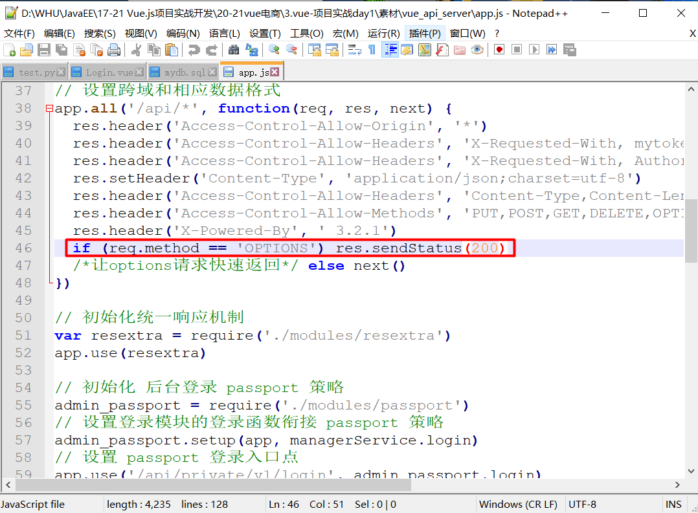

# Vue电商项目踩坑

## 1 点击登录没有响应

点击登录以后没有任何响应，用console看了没有任何输出，debug加断点函数运行了一波看起来走得很奇怪，最后发现问题是出在后端项目。后端项目原本这里使用的是`res.send(200)`版本过旧已经不支持了，windowspowershell是给了警告的，但是没有注意到，按照要求修改到sendStatus之后就响应正常了。


## 2 级联选择器的显示问题

级联选择器不加css控制，会使得选项高度高出浏览器界面

解决方法是在global的css配置中加入以下配置

```
 .el-cascader-panel{ 
     height: 200px; 
 }
```


## 3 代码不符合ESLINT规则

**踩坑：**报错，代码不符合eslint规则。

为了在vs code中解决这个麻烦的问题。

首先，我们在vs code中安装Eslint插件：


安装完成以后，我们在File->Preference->settings中找到extensions，然后在里面找到Eslint，然后在其打开`settings.json`，在其中增加一行。


```json
    "editor.codeActionsOnSave": {
        "source.fixAll": true
    }
```

增加之后的`settings.json`内容如下：


## 4 vue/no-unused-vars

在我们代码中如果定义一个变量但是没有使用就会出现error。解决方案是：

首先在.eslintrc.js中将该报错关闭。


如果重启项目之后仍然有该报错，多半是因为文件配置与项目配置实际不一致。我们运行`vue ui`查看项目可视化配置界面在`ESLint configuration`中将该检查规则关闭，刷新重启项目即可。

